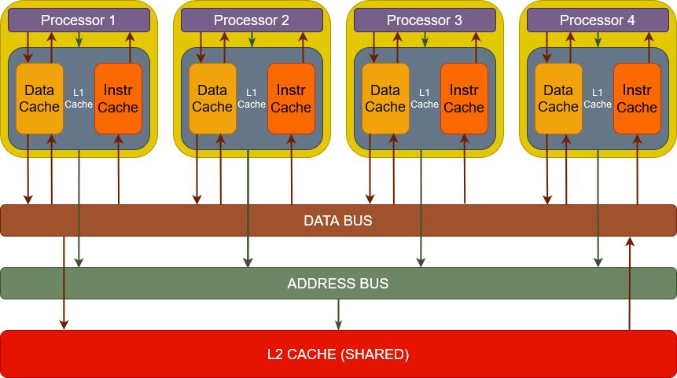
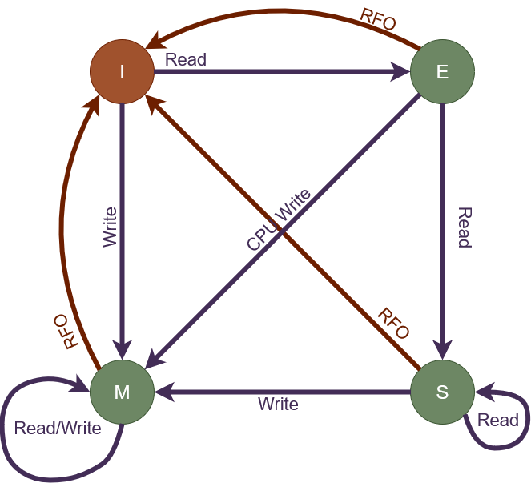

# ECE485GroupProject

<H1>OBJECTIVE:</H1>
The aim of this project is to create a simulation of a split L1 Cache for a new 32-bit processor, which can be used concurrently with 3 other processors which share L2 Cache. The system will use MESI protocol.
<H1>DESIGN SPECIFICATION:</H1>

- 32-bit processor
    - 32 address bits
      - 16k sets
        - 214 = 16k
        - ∴ 14 bits required to for address select
      - 64 byte lines
        - 26 = 64 
        - ∴ 6 bits required to for byte select
      - Tag bits are remaining
        - 32-14-9=12 
        - ∴ 12 bits for tag select
- Cache coherence
    - MESI protocol
- Simulate L1 Split Cache
    - L1 instruction Cache 
      - 4-way associativity
      - 16k sets
        - 16k x 4
        - 64k total cache lines
      - 64k byte lines    
        - 64K x 64 = 4096KB
          - 4MB
        - 4MB instruction cache
- L1 data cache
    - 8-way associativity
    - 16k sets
      - 16k x 8
        - 128k total cache lines
    - 64 byte line
      - 128k x 64 = 8192K
        - 8MB
    - 8MB data cache
- L2 cache shared by 4 processors

The simulator has two modes. In mode 0, it displays the usage statistics and responses to trace number 9; and in mode 1 it displays everything that is displayed in mode 0 along with the communication messages with L2 cache. According to the user input, the mode can be changed without recompilation. 

<H1>BLOCK DIAGRAM: </H1>

<H1>STATE DIAGRAM/MESI PROTOCOL:</H1>

